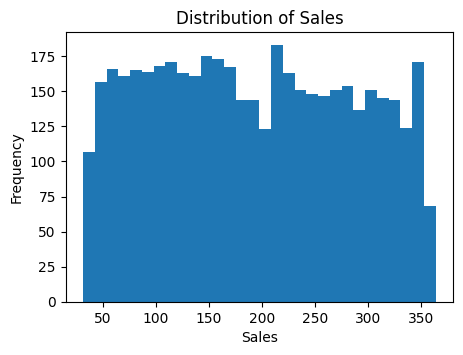
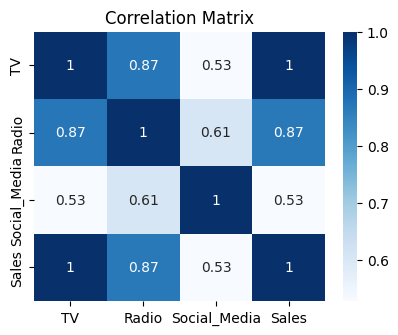
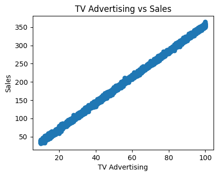
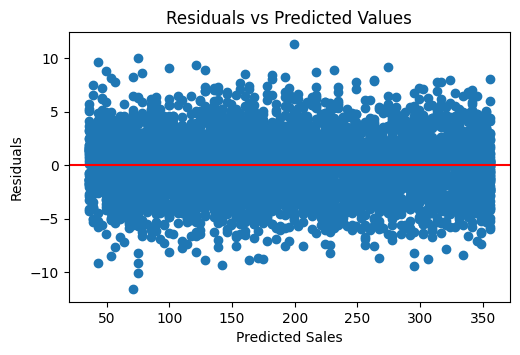
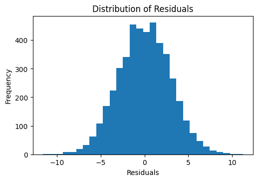
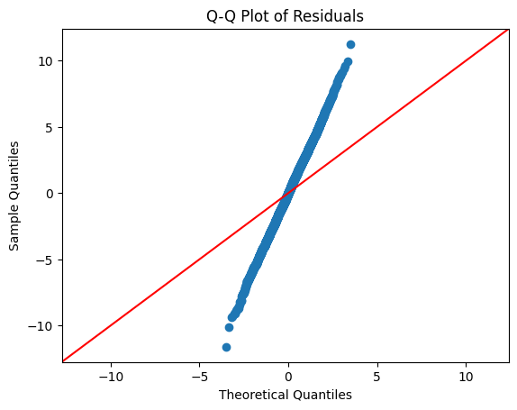

# Simple Linear Regression – Marketing ROI Analysis
## Project Overview
This project investigates the relationship between marketing expenditure and sales using Simple Linear Regression. The objective is to identify the marketing channel with the strongest influence on sales and provide a data-driven recommendation for marketing budget allocation.
The analysis was conducted using Python, Pandas, Matplotlib, Seaborn, and Statsmodels.

## Dataset Description
The dataset contains the following variables:
| Variable     | Description                          |
| ------------ | ------------------------------------ |
| TV           | TV advertising expenditure           |
| Radio        | Radio advertising expenditure        |
| Social_Media | Social media advertising expenditure |
| Sales        | Product sales                        |

## Project Objectives
The project aims to:
* Load and explore the dataset
* Handle missing values
* Perform exploratory data analysis (EDA)
* Identify the marketing channel most correlated with Sales
* Build a Simple Linear Regression model using OLS regression
* Validate regression assumptions
* Interpret model performance metrics
* Provide a marketing ROI recommendation

## Technologies Used
* Python
* Pandas
* NumPy
* Matplotlib
* Seaborn
* Statsmodels

## Installation
Install required libraries:

pip install seaborn & statsmodels

## Data Exploration and Cleaning
The dataset was examined using:

* head()
* info()
* describe()
* isnull().sum()
Missing values were identified and removed
This ensured that only complete observations were used in the regression analysis.

## Exploratory Data Analysis (EDA)
### Distribution of Sales

The histogram shows the distribution of Sales across all observations.

### Correlation Matrix

Correlation analysis revealed that TV advertising had the strongest relationship with Sales.

### TV Advertising vs Sales

The scatter plot demonstrates a strong positive linear relationship between TV advertising and Sales.

## Variable Selection
Correlation analysis produced the following findings:

| Variable     | Correlation with Sales |
| ------------ | ---------------------- |
| TV           | 0.9995                 |
| Radio        | 0.8686                 |
| Social_Media | 0.5274                 |
TV advertising had the highest correlation with Sales and was selected as the independent variable for the regression model.

## Model Building
An Ordinary Least Squares (OLS) regression model was built using Statsmodels.
Dependent Variable:
* Sales
Independent Variable:
* TV

## Regression Results
### Model Performance
* R-squared = 0.999
* Adjusted R-squared = 0.999
Interpretation:
Approximately 99.9% of the variation in Sales is explained by TV advertising expenditure.

### Coefficient Interpretation
TV Coefficient = 3.5615
Interpretation:
For every one-unit increase in TV advertising expenditure, Sales increase by approximately 3.56 units.

### Statistical Significance
P-value = 0.000
Since the p-value is less than 0.05, TV advertising is a statistically significant predictor of Sales.

### Regression Equation
Sales = -0.132493 + 3.561514(TV)

## Assumption Testing
### Residuals vs Fitted Values

The residuals are randomly distributed around zero, indicating that the assumptions of linearity and homoscedasticity are satisfied.

### Histogram of Residuals

The residuals appear approximately bell-shaped and centered around zero.

### Q-Q Plot

The residuals closely follow the reference line, indicating that the normality assumption is satisfied.

## Business Recommendation
Based on the correlation analysis and regression results:
* TV advertising has the strongest relationship with Sales.
* The regression model explains approximately 99.9% of sales variation.
* TV advertising is statistically significant with a p-value less than 0.05.

Recommendation:
The company should prioritize TV advertising when allocating marketing budgets because it demonstrates the strongest impact on Sales and is expected to provide the highest return on investment (ROI).

## Conclusion
This project successfully applied Simple Linear Regression to evaluate the impact of marketing expenditure on Sales.

The analysis identified TV advertising as the most influential marketing channel. The OLS regression model achieved an R-squared value of 0.999, indicating exceptional predictive performance. Diagnostic tests confirmed that the assumptions of linearity, homoscedasticity, and normality were satisfied.

Based on these findings, increased investment in TV advertising is expected to generate the greatest improvement in Sales performance and deliver the strongest marketing ROI.

## Author
Alhassan Aliyu Liman